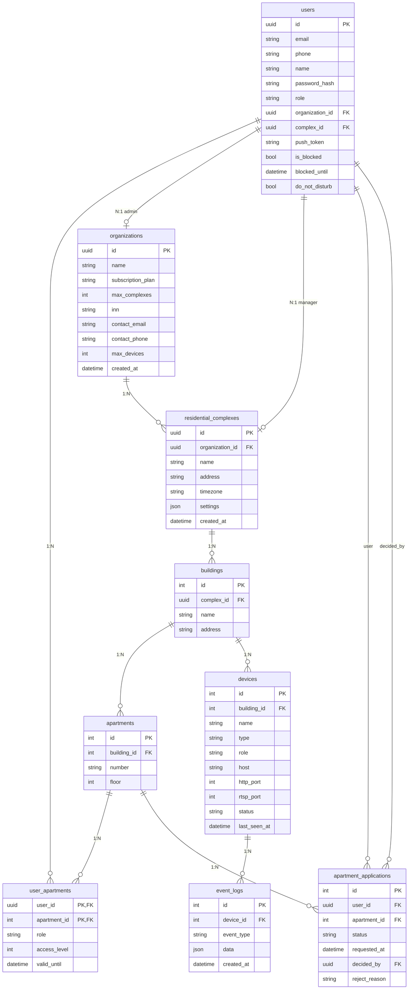

# Модель данных (ER)

Иерархия: **Организация (УК)** → **Жилой комплекс (ЖК)** → **Здание** → **Квартира**. Устройства привязаны к зданию. Пользователи связаны с организацией/ЖК (админы) или с квартирами через привязку (жители).

## Диаграмма сущностей и связей



## Упрощённая иерархия

```
Организация (УК)
  └── Жилой комплекс (ЖК)
        └── Здание
              ├── Квартиры
              └── Устройства (домофоны, камеры)

Пользователи:
  - привязаны к организации/ЖК (роли админов)
  - привязаны к квартирам через user_apartments (жители)
Заявки (apartment_applications): житель → квартира → решение админа.
```

## Роли и доступ к данным

| Роль | Описание | Что видит/редактирует |
|------|----------|------------------------|
| **SUPER_ADMIN** | Суперадмин | Все организации, ЖК, здания, квартиры, устройства, пользователи, заявки. Полный доступ ко всему. |
| **ORG_ADMIN** | Администратор УК | Только свою организацию и все её ЖК, здания, устройства, жителей в этих зданиях. Может создавать менеджеров ЖК. |
| **COMPLEX_MANAGER** | Менеджер ЖК | Только свой жилой комплекс и его здания, квартиры, устройства, жителей. |
| **RESIDENT** | Житель | Только здания, где у пользователя есть привязанные квартиры (через user_apartments); заявки на привязку, настройки «не беспокоить». |

Логика доступа реализована в `AccessService` (`src/access/access.service.ts`): `getAllowableBuildingIds`, `assertCanAccessOrganization`, `assertCanAccessComplex`, `getViewableUserIds`.

## Сущности в коде

| Таблица | Путь к entity |
|---------|----------------|
| organizations | `src/organizations/entities/organization.entity.ts` |
| residential_complexes | `src/residential-complexes/entities/residential-complex.entity.ts` |
| buildings | `src/buildings/entities/building.entity.ts` |
| apartments | `src/apartments/entities/apartment.entity.ts` |
| devices | `src/devices/entities/device.entity.ts` |
| users | `src/users/entities/user.entity.ts` |
| user_apartments | `src/users/entities/user-apartment.entity.ts` |
| apartment_applications | `src/apartments/entities/apartment-application.entity.ts` |
| event_logs | `src/events/entities/event-log.entity.ts` |
