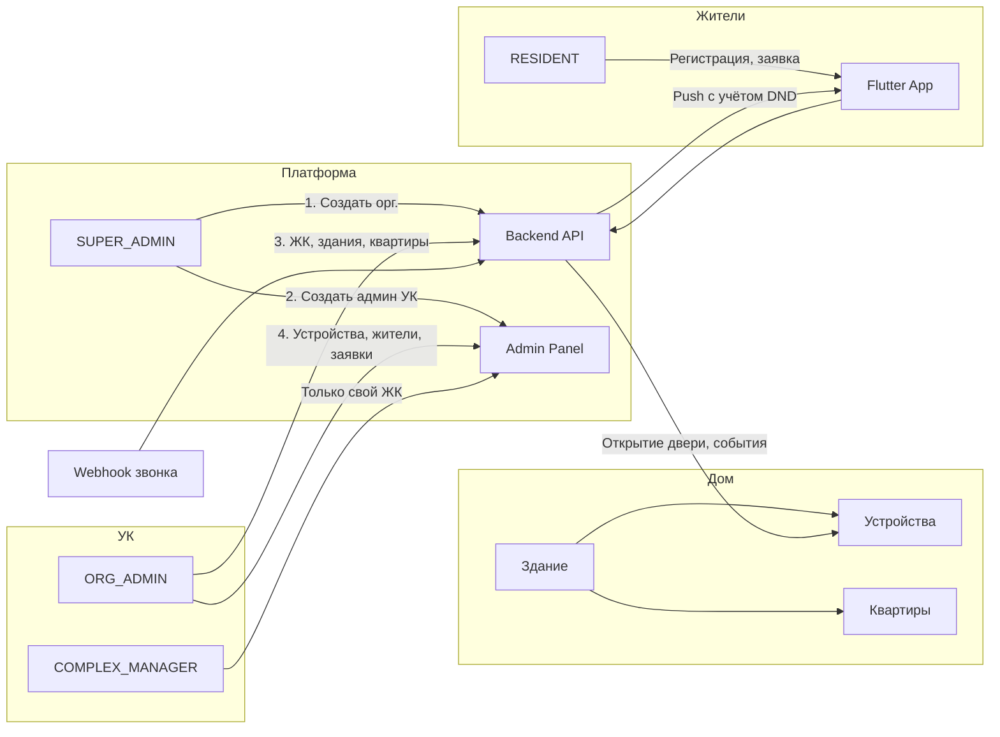

# Внедрение системы в каждый дом и поддержка

Пошаговая инструкция: от первого запуска платформы до подключения нового дома и ежедневной поддержки.

---

## 1. Первичный запуск платформы (один раз)

### 1.1 Среда и БД

- Установить Node.js (LTS), при необходимости — PostgreSQL.
- Скопировать `backend/.env.example` в `backend/.env`, задать `DB_TYPE` (sqlite или postgres), при postgres — DB_HOST, DB_PORT, DB_USERNAME, DB_PASSWORD, DB_NAME.
- Для PostgreSQL: создать БД (например по [create-db-windows.md](../scripts/create-db-windows.md) или create-db.ps1).
- Выполнить в backend: `npm install`, `npm run build` (или `npm run start:dev`).

### 1.2 Первый супер-админ

- Зарегистрировать пользователя через приложение или `POST /api/auth/register` (email или телефон + пароль).
- Выдать роль: `node scripts/make-super-admin.js <email>` (из каталога backend, с настроенным .env).

### 1.3 Проверка

- Вход в админку: `https://<хост>/api/admin` (или http при локальной разработке).
- Вход под созданным пользователем — должны быть вкладки: Дашборд, Организации, ЖК, Здания, Пользователи, Устройства, Заявки.

---

## 2. Подключение новой УК (организации)

1. В админке под супер-админом открыть **Организации** → создать организацию (название, при необходимости тариф/лимиты: max_complexes, max_devices).
2. **Создать администратора УК:** вкладка **Пользователи** → форма «Создать администратора УК»: email или телефон, пароль, организация, роль «Админ УК» → «Создать».
3. Передать учётные данные админу УК; вход в ту же админку — у него будут вкладки без «Организации» и без формы создания админа УК, только своя зона (Дашборд, ЖК, Здания, Квартиры, Устройства, Жители, Заявки).

---

## 3. Подключение нового дома (ЖК / здание) в существующей УК

1. Войти в админку под **админом УК** (или супер-админом).
2. **ЖК:** вкладка **ЖК** → создать жилой комплекс (название, адрес при необходимости).
3. **Здание:** вкладка **Здания** → создать здание (привязать к ЖК, название, адрес).
4. **Квартиры:** вкладка **Квартиры** → выбрать здание → **Импорт квартир** (CSV/Excel) или добавить вручную.
5. **Устройства:** вкладка **Устройства** → добавить устройство к нужному зданию (тип Akuvox/Uniview и т.д., Host, порты, логин/пароль) → **Проверить связь** (при редактировании устройства — статус обновится на онлайн/офлайн).
6. **Доступ панелей к бэкенду:** см. [NETWORK_SETUP.md](NETWORK_SETUP.md) — либо Port Forwarding на роутере дома, либо VPN; в поле Host устройства указать IP/порт, с которых бэкенд достучится до панели.
7. **Входящие звонки:** на панели/шлюзе настроить webhook на `POST <хост>/api/webhooks/intercom/event` с телом `{ "deviceId": <id>, "type": "incoming_call", "apartmentId?", "apartmentNumber?", "snapshotUrl?" }`; при необходимости задать `WEBHOOK_SECRET` в .env и передавать в заголовке `X-Webhook-Secret`.

---

## 4. Жители в доме

1. **Вариант А — заявки:** житель регистрируется в приложении → в приложении выбирает здание и квартиру → подаёт заявку; в админке вкладка **Заявки жителей** → одобрить/отклонить.
2. **Вариант Б — привязка УК:** в админке **Квартиры** → выбрать здание → открыть квартиру → раздел «Жители» → добавить жителя по email/телефону (и при необходимости создать учётную запись через регистрацию тем же email/телефоном).
3. После привязки/одобрения заявки житель видит здание и устройства в приложении, может открывать дверь, смотреть события и при входящем звонке получать push (если не включён режим «Не беспокоить»).

---

## 5. Поддержка и типовые операции

- **Дашборд:** в админке смотреть сводку (количество ЖК, зданий, устройств, онлайн/офлайн, жители, заявки на одобрение).
- **Офлайн устройство:** в Устройствах проверить Host/порт и сеть; нажать «Проверить связь» — при успехе статус станет «онлайн».
- **Блокировка жителя:** вкладка Пользователи (для staff) → «Заблокировать» у нужного пользователя; разблокировка — «Разблокировать».
- **Менеджер только по одному ЖК:** супер-админ создаёт пользователя через «Создать администратора УК» с ролью «Менеджер ЖК» и выбором ЖК; этот пользователь видит в админке только свой ЖК и связанные здания/квартиры/устройства/заявки.
- **Резервное копирование:** регулярно бэкапить БД (файл SQLite или дамп PostgreSQL) и .env (без публикации в репозиторий).

---

## 6. Схема внедрения (роли и шаги)

