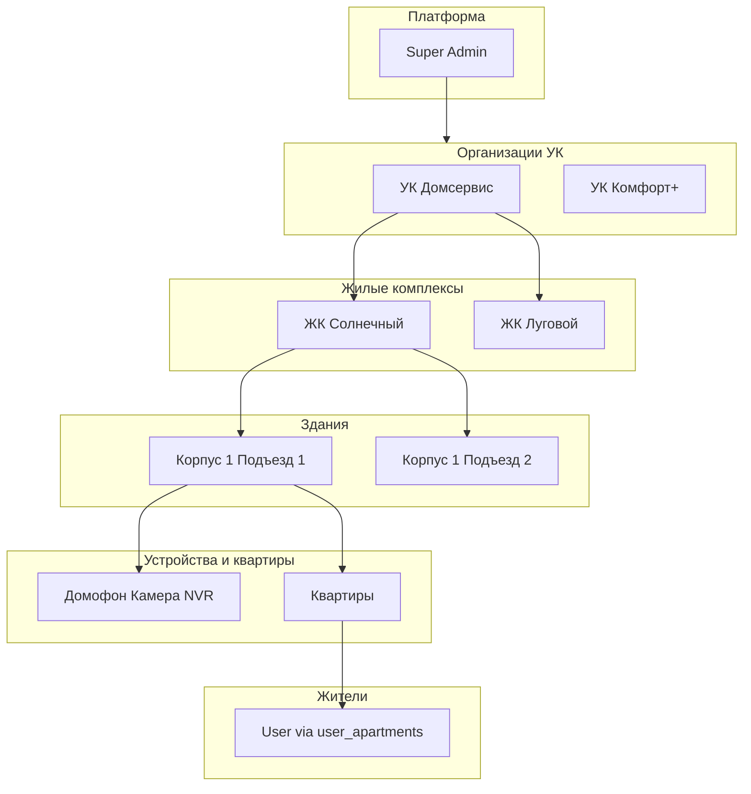
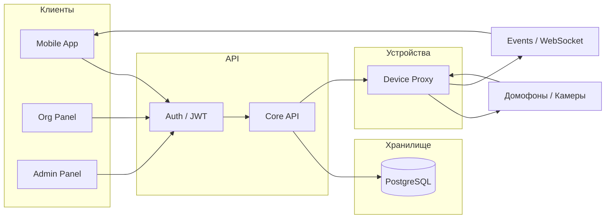

# Полная спецификация системы: иерархия, алгоритмы и сценарии

Рабочая конфигурация БД для продакшена и масштабирования — **PostgreSQL**. Для локальной разработки допускается SQLite (см. [BACKEND.md](../BACKEND.md)).

Детали API и запуск — [BACKEND.md](../BACKEND.md). Краткая архитектура — [SYSTEM_DESIGN.md](../SYSTEM_DESIGN.md).

---

## Часть 1. Иерархия данных

### 1.1 Главная диаграмма связей



### 1.2 Дерево на примере УК «Домсервис» и ЖК «Солнечный»

```
ПЛАТФОРМА
├── Super Admin (администраторы платформы)
│
├── ОРГАНИЗАЦИЯ: УК "Домсервис"
│   ├── Сотрудники УК (ORG_ADMIN, COMPLEX_MANAGER)
│   ├── ЖК "Солнечный"
│   │   ├── Корпус 1
│   │   │   ├── Подъезд 1
│   │   │   │   ├── Устройства (домофон, камера)
│   │   │   │   ├── Кв. 1, 2, 3, ... 50
│   │   │   │   └── Жители (user_apartments)
│   │   │   └── Подъезд 2
│   │   │       └── ...
│   │   └── Корпус 2
│   │       └── ...
│   └── ЖК "Луговой"
│       └── ...
│
└── ОРГАНИЗАЦИЯ: УК "Комфорт+"
    └── ...
```

---

## Часть 2. Связи сущностей (ER)

Текущая модель без новых таблиц:

| Связь | Тип | Описание |
|-------|-----|----------|
| Organization → ResidentialComplex | 1:N | Одна УК владеет многими ЖК |
| ResidentialComplex → Building | 1:N | Один ЖК содержит много зданий |
| Building → Apartment | 1:N | Одно здание содержит много квартир |
| Building → Device | 1:N | К зданию привязаны устройства |
| User ↔ Apartment (через UserApartment) | N:M | Житель — несколько квартир; в квартире — несколько жителей |
| User (ORG_ADMIN/COMPLEX_MANAGER) → Organization / Complex | N:1 | Сотрудник УК привязан к организации или к одному ЖК |

Сущности: **organizations**, **residential_complexes**, **buildings**, **apartments**, **devices**, **users**, **user_apartments**, **event_logs**.

---

## Часть 3. Алгоритм Super Admin

### 3.1 Сценарий: подключение новой организации

1. **Создать организацию**  
   Admin Panel → Организации → «Создать». Указать: название, тариф (subscription_plan), max_complexes, при необходимости ИНН, контактный email/телефон, max_devices.

2. **Создать/пригласить админа УК**  
   Сейчас: пользователь регистрируется через API (POST /api/auth/register), затем в БД ему выставляют роль ORG_ADMIN и organization_id (вручную или скриптом `npm run db:super-admin` для SUPER_ADMIN; для орг. админа — обновить запись в таблице users). В перспективе — API приглашения с отправкой email.

3. **Передать управление**  
   Админ УК входит в панель и сам добавляет ЖК, здания, квартиры, устройства, жителей (в рамках своей организации).

4. **Мониторинг**  
   Super Admin видит все организации, устройства, события; при необходимости — алерты по офлайн-устройствам и биллинг.

### 3.2 Чек-лист: подключение новой организации

- [ ] Получить реквизиты организации (название, при необходимости ИНН, контакты)
- [ ] Создать организацию в Admin Panel (тариф, лимиты)
- [ ] Создать учётную запись администратора УК (регистрация + выдача роли и organization_id)
- [ ] Передать клиенту данные для входа и инструкцию
- [ ] Убедиться, что админ УК вошёл и начал настройку ЖК

---

## Часть 4. Алгоритм УК (настройка нового ЖК)

### 4.1 Пошаговый сценарий

1. **Создать ЖК**  
   ЖК и здания → «Добавить ЖК»: название, адрес, часовой пояс.

2. **Создать здания**  
   В выбранном ЖК → «Добавить здание»: название (например, «Корпус 1, Подъезд 1»), адрес.

3. **Создать квартиры**  
   Вариант А: вручную (для каждого здания — добавление квартир по одной).  
   Вариант Б: массовый импорт (API POST /api/buildings/:id/apartments/import с CSV/Excel) — см. документацию API.

4. **Добавить устройства**  
   Устройства → «Добавить устройство»: выбрать здание, указать тип (домофон/камера/NVR), производителя, host, логин/пароль. Либо ONVIF discovery по зданию (если реализовано).

5. **Добавить жителей**  
   Вручную: раздел «Жители» → привязка пользователя к квартире (по email/телефону/userId). Либо массовый импорт жителей (CSV/Excel). Либо житель подаёт заявку через приложение — УК одобряет (см. заявки в Фазе 2).

### 4.2 Чек-лист: настройка нового ЖК

- [ ] Создать ЖК (название, адрес)
- [ ] Добавить все здания (корпуса/подъезды)
- [ ] Добавить квартиры (вручную или импорт)
- [ ] Добавить устройства (домофоны, камеры), проверить связь
- [ ] Добавить жителей или настроить приём заявок от жителей
- [ ] Протестировать открытие двери и при необходимости видео

---

## Часть 5. Алгоритм жителя

### 5.1 Путь жителя

1. **Регистрация**  
   Приложение или API: POST /api/auth/register (email или телефон, пароль). Роль по умолчанию — RESIDENT.

2. **Привязка к квартире**  
   Вариант А: УК добавляет жителя в квартиру (POST /api/apartments/:id/residents).  
   Вариант Б: житель подаёт заявку (POST /api/apartments/:id/apply); УК одобряет (PATCH /api/apartments/applications/:id). После одобрения создаётся запись в user_apartments.

3. **Использование**  
   Житель видит в приложении свои здания (по user_apartments), устройства этих зданий; может открывать дверь, смотреть видео, получать события (WebSocket). События входящего звонка при реализации push — уведомление на устройство.

### 5.2 Что видит житель в приложении

- Список «Мои квартиры» (здание, адрес, номер квартиры)
- По каждому зданию — устройства (домофон, камеры): просмотр камеры, открытие двери
- История событий (звонки, открытия)
- Свои заявки на привязку (статус: на рассмотрении / одобрено / отклонено)

### 5.3 Чек-лист: начало работы жителя

- [ ] Скачать приложение, зарегистрироваться (телефон или email)
- [ ] Подать заявку на привязку к квартире или дождаться добавления УК
- [ ] После одобрения — проверить доступ к домофону и камере
- [ ] Включить уведомления при необходимости

---

## Часть 6. Матрица доступов

| Функция | Super Admin | Админ УК (ORG_ADMIN) | Менеджер УК (COMPLEX_MANAGER) | Житель (RESIDENT) |
|---------|-------------|----------------------|-------------------------------|-------------------|
| Организации: видеть все | Да | Нет | Нет | Нет |
| Организации: создавать/редактировать | Да | Только свою | Нет | Нет |
| ЖК: видеть | Все | Только своей орг. | Только свой ЖК | Только по своим квартирам |
| ЖК: создавать/редактировать | Да | Да | Редактировать свой | Нет |
| Здания/квартиры: создавать, редактировать | Да | Да (свои) | Да (свои) | Нет |
| Устройства: видеть | Все | Своей орг. | Своего ЖК | Только зданий своих квартир |
| Устройства: добавлять/настраивать | Да | Да | Да | Нет |
| Открыть дверь / смотреть камеру | Да | Да | Да | Да (свои здания) |
| Жители: видеть/добавлять/одобрять заявки | Да | Своей орг. | Своего ЖК | Нет (только свои заявки) |
| События: видеть | Все | Своей орг. | Своего ЖК | Свои |
| Система: метрики, логи, имперсонация | Да | Нет | Нет | Нет |

Реализация проверок — в [AccessService](../src/access/access.service.ts).

---

## Часть 7. Data flow (упрощённая схема)



Без Redis/Media Server в текущей реализации: один backend, БД, WebSocket для событий, вызовы устройств через существующие сервисы (Akuvox, Uniview).

---

## Часть 8. Сценарий входящего звонка (end-to-end)

### 8.1 Целевой поток

1. **Инициация**  
   Гость нажимает кнопку квартиры на домофоне. Домофон (или шлюз) отправляет событие в backend: тип `incoming_call` (или `door_call`), device_id, номер квартиры или apartment_id.

2. **Обработка в backend**  
   - Проверка: устройство активно, квартира существует.  
   - Поиск жителей: выборка из user_apartments по apartment_id, учёт valid_until (активные).  
   - Формирование списка userId для push.

3. **Push-уведомление**  
   Отправка push всем активным жителям квартиры (реализация через PushService; заглушка — логирование). Текст: «Звонок в кв. X, ЖК Y».

4. **Ответ и открытие двери**  
   Житель в приложении нажимает «Ответить» (при реализации — медиа-сессия) или сразу «Открыть дверь». Запрос на backend: POST /api/devices/:id/open-door. Проверка прав, отправка команды на устройство, логирование в event_log.

5. **Логирование**  
   В event_log пишутся: событие входящего звонка; событие открытия двери (user_id, device_id, результат). Доступ к событиям — у жителя (свои), у УК (свои здания), у Super Admin (все).

### 8.2 Edge cases

- **Никто не ответил**  
  Таймаут (например, 30–60 с). Статус события — missed_call. При реализации push — уведомление о пропущенном звонке.

- **Нет интернета у жителя**  
  Push не доставляется. Возможный fallback: SIP на резервный номер (вне текущей реализации).

- **Домофон offline**  
  Событие от устройства не приходит. УК видит устройство как офлайн (дашборд/алерт при реализации).

### 8.3 Безопасность

- Каждая команда открытия двери: JWT, проверка прав доступа к зданию устройства.
- TTL токена и защита от повтора — настройки Passport/JWT.
- Rate limit на открытие двери: реализован лимит на пользователя (например, не более 20 запросов в минуту на одного пользователя).

### 8.4 Реализованные API и сервисы

- **POST /api/devices/:deviceId/events** — приём события от устройства/шлюза. Тело: `{ type: "incoming_call", apartmentId?: number, apartmentNumber?: string, snapshotUrl?: string }`. Доступ только для пользователей с правом доступа к зданию устройства. Событие сохраняется в event_log; при типе `incoming_call` выполняется поиск жителей квартиры и вызов PushService (заглушка — логирование).
- **PushService** — абстракция отправки push; заглушка логирует вызовы; при необходимости подключается FCM/APNs.
- Типы событий: `incoming_call`, `door_open`, `missed_call` (константы в коде).

---

## Приложение: форматы массового импорта

### Импорт квартир (POST /api/buildings/:id/apartments/import)

Файл: **CSV** или **Excel** (.xlsx, .xls), либо JSON: `{ "apartments": [ { "number": "1", "floor": 1 }, ... ] }`.

**Колонки файла:**

| Колонка (EN/RU) | Обязательно | Описание |
|-----------------|-------------|----------|
| number / номер / No / № | Да | Номер квартиры (уникален в рамках здания) |
| floor / этаж | Нет | Этаж |
| rooms / комнат | Нет | Количество комнат (при наличии поля в модели) |
| area / площадь | Нет | Площадь (при наличии поля в модели) |

**Пример CSV:**

```csv
number,floor
1,1
2,1
3,2
```

Лимит: до 1000 строк за запрос, размер файла до 5 МБ.

---

### Импорт жителей (POST /api/buildings/:id/residents/import)

Файл: **CSV** или **Excel**, либо JSON: `{ "residents": [ { "apartmentNumber": "1", "email": "a@b.com", "name": "Иван", "role": "resident" }, ... ] }`.

**Колонки файла:**

| Колонка (EN/RU) | Обязательно | Описание |
|-----------------|-------------|----------|
| apartment / квартира / номер | Да | Номер квартиры (должен существовать в выбранном здании) |
| email / почта | Один из двух | Email жителя (для поиска или создания пользователя) |
| phone / телефон | Один из двух | Телефон жителя |
| name / ФИО / fullname | Нет | ФИО |
| role / роль | Нет | owner, resident или guest (по умолчанию resident) |

**Логика:** для каждой строки система ищет пользователя по email или телефону; если не найден — создаёт нового с временным паролем и ролью RESIDENT, затем привязывает к квартире (user_apartments). УК должна сообщить новым жителям о необходимости сменить пароль при первом входе.

**Пример CSV (шаблон):**

```csv
apartment,email,phone,name,role
1,ivanov@example.com,+79001234567,Иван Иванов,owner
2,,+79007654321,Петр Петров,resident
3,guest@example.com,,Гость,guest
```

Лимит: до 1000 строк за запрос, размер файла до 5 МБ.

---

*Документ актуален для текущей модели данных и API. Расширения (заявки жителей, импорт, имперсонация, события входящего звонка) описаны в плане внедрения и в BACKEND.md.*
